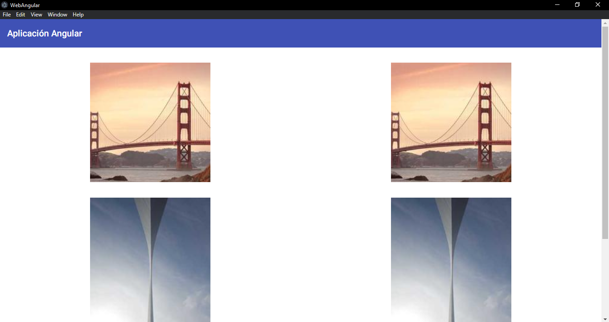
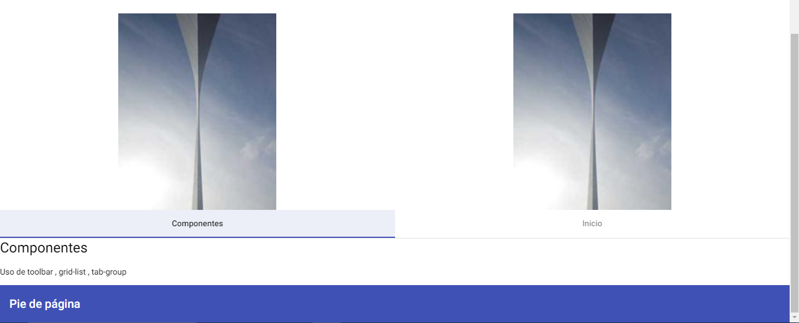

# angular_electron
Web Angular se convierte a Escritorio con Electron

# Angular Electron

Usamos la aplicación llamada Angular Material, ir a la aplicación, <a href="https://angularmaterialyei.netlify.app/"> Acceder</a>

## Resultado

